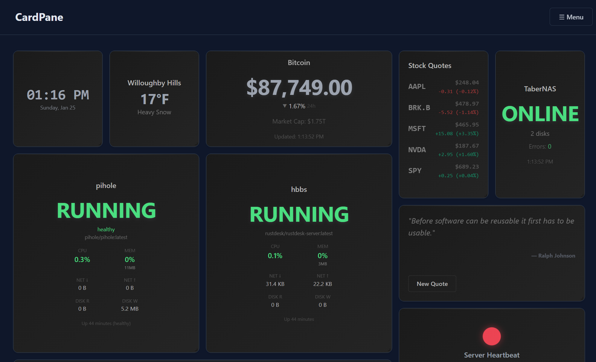

# CardPane



A highly customizable, widget-based dashboard system with real-time updates via Server-Sent Events (SSE). Built with React, TypeScript, and Vite.

## Features

- **Widget Architecture**: Modular widgets with both frontend and backend components
- **Real-time Updates**: Server-Sent Events (SSE) for live data streaming
- **Drag & Resize**: Interactive grid layout powered by react-grid-layout
- **Secrets Management**: Secure API key management per widget type
- **Configuration UI**: Per-instance widget configuration
- **Theming**: Multiple stylesheets with live switching (Default, Neon)
- **AI Integration**: RESTful API endpoints for AI consumption and monitoring
- **Extensible**: Easy-to-add custom widgets with hot reloading

## Quick Start

### Prerequisites

- Node.js 18+ (recommended: 20+)
- npm or yarn

### Installation

1. Clone the repository:
```bash
git clone https://github.com/yourusername/cardpane.git
cd cardpane
```

2. Install dependencies:
```bash
npm install
```

### Running the Application

The application consists of two components that must run simultaneously:

#### 1. Start the Backend Server

```bash
npm run server
```

The server will start on `http://localhost:3001` and handle:
- Widget backend initialization
- SSE connections for real-time updates
- API endpoints for configuration and AI integration
- Secrets management

#### 2. Start the Frontend (in a separate terminal)

```bash
npm run dev
```

The frontend will start on `http://localhost:5173` (or the next available port).

### Access the Dashboard

Open your browser to `http://localhost:5173`

## Project Structure

```
cardpane/
├── server/
│   ├── index.js          # Express server with SSE and API endpoints
│   ├── secrets.js        # Secrets management system
│   └── crypto.js         # Encryption utilities
├── src/
│   ├── core/
│   │   └── types.ts      # TypeScript interfaces
│   ├── components/
│   │   ├── Dashboard.tsx # Main dashboard component
│   │   ├── StyleSwitcher.tsx
│   │   └── EditWidgetModal.tsx
│   ├── styles/
│   │   ├── widgets.css   # Default stylesheet
│   │   └── widgets-neon.css  # Neon theme
│   └── widgets-external/
│       ├── weather/      # Weather widget
│       ├── heartbeat/    # Server health widget
│       ├── clock/        # Clock widget
│       ├── quote/        # Quote widget
│       └── sse-debugger/ # SSE debugging widget
├── package.json
└── vite.config.ts
```

## Widget Development

### Creating a New Widget

1. Create a new folder in `src/widgets-external/your-widget/`
2. Create `index.ts` with widget definition
3. Create `YourWidgetComponent.tsx` for frontend
4. (Optional) Create `backend.js` for server-side logic

See [WIDGET_TEMPLATE.md](WIDGET_TEMPLATE.md) for detailed instructions.

### Example Widget Structure

```typescript
// index.ts
export const widget: Widget = {
  id: 'my-widget',
  name: 'My Widget',
  description: 'Does something cool',
  component: MyWidgetComponent,
  defaultSize: { w: 4, h: 4 },
  secretsSchema: {
    apiKey: {
      type: 'string',
      label: 'API Key',
      description: 'Your API key',
      required: true
    }
  }
};
```

## Secrets Management

Widgets that need API keys or sensitive data use the secrets management system.

### Setting Widget Secrets (UI Method - Recommended)

1. Click the **⚙️ Settings** button in the dashboard header
2. Navigate to the **Widget Secrets** tab
3. Find your widget in the list
4. Click **Configure**
5. Enter your API key and other settings
6. Click **Save Secrets**

The widget backends will restart automatically with your new settings.

### Setting Widget Secrets (API Method)

You can also use the REST API to configure secrets:

```bash
curl -X POST http://localhost:3001/api/admin/widgets/weather-widget/secrets \
  -H "Content-Type: application/json" \
  -d '{
    "apiKey": "your-api-key",
    "city": "London",
    "units": "metric"
  }'
```

See [SETTINGS_UI_GUIDE.md](SETTINGS_UI_GUIDE.md) for the complete UI guide, or [SECRETS_GUIDE.md](SECRETS_GUIDE.md) for API details.

## AI Integration

The dashboard exposes RESTful endpoints for AI consumption:

### Get Dashboard Summary

```bash
curl http://localhost:3001/api/dashboard/ai-summary
```

Returns structured JSON with all widget data, health status, and metadata.

### Example Response

```json
{
  "timestamp": "2026-01-09T18:30:00.000Z",
  "dashboard_state": "operational",
  "widget_count": 3,
  "health_summary": {
    "healthy": 3,
    "error": 0,
    "stale": 0
  },
  "widgets": [
    {
      "type": "weather-widget",
      "instance_id": "abc-123",
      "status": "healthy",
      "data": {
        "temperature": 22,
        "condition": "Partly Cloudy",
        "humidity": 65,
        "city": "London"
      }
    }
  ]
}
```

See [AI_INTEGRATION.md](AI_INTEGRATION.md) for complete API documentation and use cases.

## Styling & Themes

### Switch Themes

Click the paint palette icon (🎨) in the top-right corner to switch between:
- **Default**: Clean, modern design
- **Neon**: Cyberpunk-inspired theme with glowing effects

### Create Custom Themes

1. Create a new stylesheet in `src/styles/widgets-mytheme.css`
2. Use the same CSS class names as `widgets.css`
3. Add your theme to `StyleSwitcher.tsx`

See [WIDGET_STYLING.md](WIDGET_STYLING.md) for styling guidelines.

## Configuration Files

### Environment Variables

Create a `.env` file (optional):

```bash
PORT=3001
SECRETS_KEY=your-encryption-key-here
```

### Widget Layout

Dashboard layout is saved to `dashboard-layout.json` automatically when you:
- Add/remove widgets
- Resize widgets
- Move widgets

## Available Scripts

- `npm run dev` - Start frontend development server
- `npm run server` - Start backend server
- `npm run build` - Build for production
- `npm run preview` - Preview production build
- `npm run lint` - Run ESLint

## Troubleshooting

### Port Already in Use

If port 3001 is taken, edit `server/index.js` and change:
```javascript
const PORT = process.env.PORT || 3001;
```

### Widgets Not Loading

1. Check that both frontend and backend are running
2. Check browser console for errors
3. Check server logs for initialization errors
4. Ensure secrets are configured for widgets that require them

### SSE Connection Issues

1. Verify server is running on port 3001
2. Check browser Network tab for SSE connection status
3. Use the SSE Debugger widget to monitor events

## Documentation

- [WIDGET_TEMPLATE.md](WIDGET_TEMPLATE.md) - Complete widget development guide
- [SETTINGS_UI_GUIDE.md](SETTINGS_UI_GUIDE.md) - Settings UI for configuring widgets
- [SECURITY_MODEL.md](SECURITY_MODEL.md) - Security architecture and best practices
- [SECRETS_GUIDE.md](SECRETS_GUIDE.md) - Secrets management architecture
- [WIDGET_STYLING.md](WIDGET_STYLING.md) - Styling guidelines
- [AI_INTEGRATION.md](AI_INTEGRATION.md) - AI/API integration
- [QUICKSTART_SECRETS.md](QUICKSTART_SECRETS.md) - Quick secrets setup
- [Crypto Price Widget](src/widgets-external/crypto-price/README.md) - Reference implementation

## Technology Stack

- **Frontend**: React 19.2.0, TypeScript 5.9.3, Vite 6.0.11
- **Backend**: Node.js, Express, Server-Sent Events
- **Grid**: react-grid-layout
- **Styling**: CSS with CSS variables for theming
- **Security**: AES-256-GCM encryption for secrets

## Contributing

1. Create a new widget in `src/widgets-external/`
2. Follow the widget template guidelines
3. Add proper TypeScript types
4. Include `dataExportSchema` for AI integration
5. Document secrets and configuration options

## License

MIT License - See [LICENSE](LICENSE) file for details

## Support

For questions or issues:
1. Check the documentation in the root directory
2. Review widget examples in `src/widgets-external/`
3. Check server logs for detailed error messages
